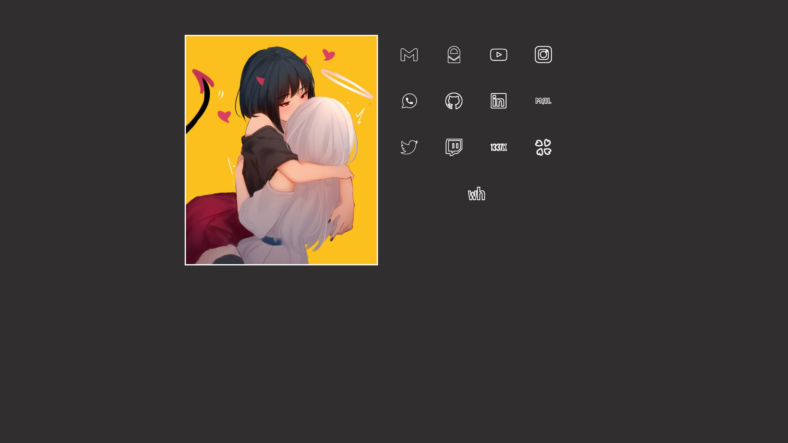

<h1>startpage</h1>
My first startpage, using HTML and CSS. 
Icons made by me using GIMP. 
Source of the images in the "images" folder: 
  -image.jpg (vertical) -> https://www.pixiv.net/en/users/8223328/artworks 
  -image.png (horizontal) -> https://www.artstation.com/kuvshinov_ilya 
 

 <h3>Vertical version:</h3> 

  

  
<h3>Horizontal version:</h3>

  

